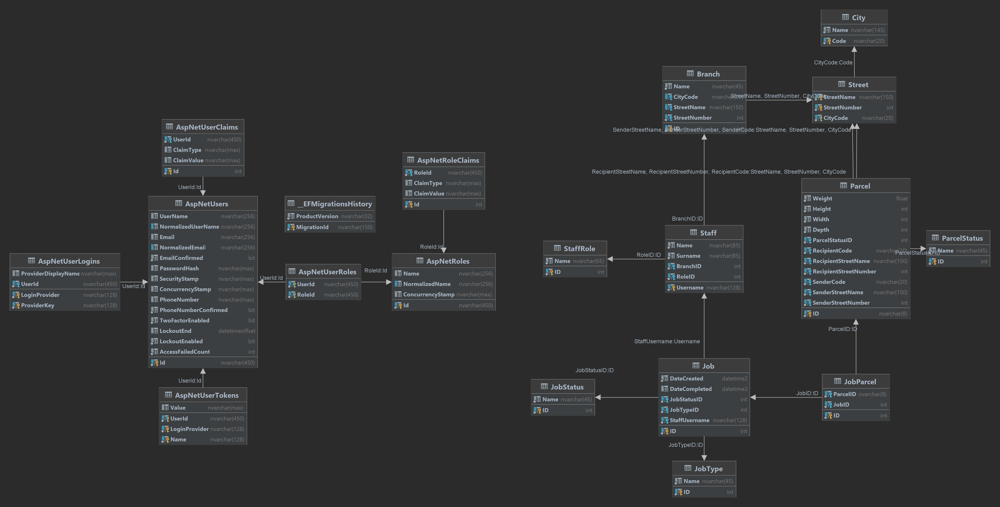

# SFL (Simple Flyway Logistics)
Informacijski sistem za logistično podporo kurirski službi

## Člana Ekipe:
- Luka Šveigl (63200301)
- Nejc Vrčon Zupan (63200327)

## Kazalo
- [Uvod](#uvod)
- [Opis delovanja sistema](#opis-delovanja-sistema)
- [Podatkovna baza](#podatkovna-baza)
- [Spletna aplikacija](#spletna-aplikacija)
- [Mobilna aplikacija](#mobilna-aplikacija)
- [Opis nalog vsakega študenta](#opis-nalog-vsakega-študenta)

## Uvod:
Z informacijskim sistemom sva podprla delo v kurirski službi. Sistem omogoča check in paketov v skladišča, pregled nad paketi v skladišču, potrjevanje tovora med premikanjem iz skladišč in pred dostavo, ter potrjevanje dostave paketa. Uporabniki sistema so zaposleni (skladiščniki, dostavljalci in vodje skladišč).

Vsak paket mora preiti čez več opravil, ki so razdeljene v tipe:
- Handover
- Check in
- Cargo departing confirmation
- Cargo arrival confirmation
- Delivery cargo confirmation
- Parcel handover

Opravila opravljajo uporabniki glede na njihove vloge:
- Warehouse manager
- Warehouse worker
- Logistics agent
- Delivery driver

Med potovanjem se samemu paketu prav tako spreminjajo statusi:
- In transit
- At the final parcel center
- In delivery
- Delivered

Tako bi lahko uporabniku na spletni aplikaciji enostavno prikazali trenuten status njegovega paketa, prav tako pa lahko z izpisom vseh opravljenih opravil na katerih je paket prikažemo bolj podrobno potovanje paketa. Sledenje paketa bi tako zelo lahko implementirali, kot enostavno nadgradnjo.

## Opis delovanja sistema:
Informacijski sistem je sestavljen iz MS SQL podatkovne baze, dveh spletnih aplikacij (testna in produkcijska), REST API-ja in mobilne aplikacije (Android). Podatkovna baza, REST API in spletne aplikacije so gostovane v storitvi Azure.

Spletne aplikacije so ustvarjene v .NET okolju. Testna aplikacija se posodablja avtomatsko z spremembami v [github repozitoriju](https://github.com/cugalord/SFL-IS), produckijska pa ročno.

REST API podpira funkcionalnost mobilne aplikacije (pregled in opravljanje opravil, ter prijava v informacijski sistem)

## Podatkovna baza:

#### Tabela City
`Tabela City` vsebuje vse poštne številke, kjer lahko opravimo dostavo.
Opis tabele:
- `Stolpec Code` predstavlja poštno številko, ki je tudi primarni ključ v tabeli
- `Stolpec Name` pa predstavlja ime kraja

#### Tabela Street
`Tabela Street` vsebuje točen naslov.
Opis tabele:
- `Stolpec StreetName` predstavlja ime ulice
- `Stolpec StreetNumber` predstavlja ulično številko
- `Stolpec CityCode` (tuji ključ na `tabelo City`) pa predstavlja poštno številko kraja ulice
Primarni ključ sestavljajo vsi trije stolpci.

#### Tabela Branch
`Tabela Branch` vsebuje poslovalnice podjetja.
Opis tabele:
- `Stolpec ID` predstavlja primarni ključ v tabeli
- `Stolpec Name` predstavlja ime poslovalnice
- `Stolpec StreetName` (tuji ključ na tabelo `Street`) predstavlja ime ulice
- `Stolpec StreetNumber` (tuji ključ na tabelo `Street`) predstavlja ulično številko
- `Stolpec CityCode` (tuji ključ na tabelo `Street`) pa predstavlja poštno številko kraja ulice 

#### Tabela StaffRole
`Tabela StaffRole` vsebuje vloge za zaposlene v podjetju.
Opis tabele:
- `Stolpec ID` predstavlja primarni ključ v tabeli.
- `Stolpec Name` predstavlja ime vloge

#### Tabela Staff
`Tabela Staff` vsebuje zaposlene v podjetju.
Opis tabele:
- `Stolpec username` predstavlja hkrati uporabniško ime in primarni ključ v tabeli.
- `Stolpec Name` predstavlja ime zaposlenega
- `Stolpec Surname` predstavlja priimek zaposlenega
- `Stolpec BranchID` (tuji ključ na tabelo `Branch`) predstavlja poslovalnico v kateri je zaposlen uslužbenec.
- `Stolpec RoleID` (tuji ključ na tabelo `StaffRole`) predstavlja vlogo zaposlenega v podjetju.

#### Tabela ParcelStatus
`Tabela ParcelStatus` vsebuje statuse paketa.
Opis tabele:
- `Stolpec ID` predstavlja primarni ključ v tabeli.
- `Stolpec Name` predstavlja ime statusa

#### Tabela Parcel
`Tabela Parcel` vsebuje pakete v sistemu.
Opis tabele:
- `Stolpec ID` predstavlja hkrati šifro paketa in primarni ključ v tabeli
- `Stolpec Weight` predstavlja težo paketa (kg)
- `Stolpec Height` predstavlja višino paketa (cm)
- `Stolpec Width` predstavlja širino paketa (cm)
- `Stolpec Depth` predstavlja globino paketa (cm)
- `Stolpec ParcelStatusID` (tuji ključ na tabelo `ParcelStatus`) predstavlja trenutni status paketa
- `Stolpec RecipientCode` (tuji ključ na tabelo `Street`) predstavlja prejemnikovo poštno številko
- `Stolpec RecipientStreetName` (tuji ključ na tabelo `Street`) predstavlja prejemnikovo ulico
- `Stolpec RecipientStreetNumber` (tuji ključ na tabelo `Street`) predstavlja prejemnikovo ulično številko
- `Stolpec SenderCode` (tuji ključ na tabelo `Street`) predstavlja pošiljateljevo poštno številko
- `Stolpec SenderStreetName` (tuji ključ na tabelo `Street`) predstavlja pošiljateljevo ulico
- `Stolpec SenderStreetNumber` (tuji ključ na tabelo `Street`) predstavlja pošiljateljevo ulično številko

#### Tabela JobType
`Tabela JobType` vsebuje vse tipe opravil.
Opis tabele:
- `Stolpec ID` predstavlja primarni ključ v tabeli
- `Stolpec Name` predstavlja ime opravila

#### Tabela JobStatus
`Tabela JobStatus` vsebuje vse statuse opravil.
Opis tabele:
- `Stolpec ID` predstavlja primarni ključ v tabeli
- `Stolpec Name` predstavlja ime statusa

#### Tabela JobParcel
`Tabela JobParcel` povezuje opravilo z paketom oz. paketi.
Opis tabele:
- `Stolpec ID` predstavlja primarni ključ v tabeli
- `Stolpec ParcelID` (tuji ključ na tabelo `Parcel`) predstavlja šifro paketa
- `Stolpec JobID` (tuji ključ na tabelo`Job`) predstavlja ID opravila

#### Tabela Job
`Tabela Job` vsebuje opravila v sistemu.
Opis tabele:
- `Stolpec ID` predstavlja primarni ključ v tabeli
- `Stolpec DateCreated` predstavlja datum, ko je bilo opravilo kreirano
- `Stolpec DateCompleted` predstavlja datum, ko je bilo opravilo zaključeno
- `Stolpec JobStatusID` (tuji ključ na tabelo `JobStatus`) predstavlja trenutni status opravila
- `Stolpec JobTypeID` (tuji ključ na tabelo `JobType`) predstavlja tip opravila
- `Stolpec StaffUsername` (tuji ključ na tabelo `Staff`) določa komu je opravilo namenjeno

#### Sistemske tabele AspNet
`Tabele AspNet` vsebujejo uporabnike v sistemu. Uporabniška imena so enaka v tabeli `Staff`.

## Spletna aplikacija
Uporabnik se prijavi v aplikacijo z njegovim uporabniškim imenom in geslom.
Uporabnikom se glede na njihovo vlogo v podjetju (uporabniška hierarhija) odprejo različna opravila:
- Skladiščniki in dostavljalci nato vidijo svoja opravila, ki jih morajo opraviti.
- Vodja skladišča lahko vidi še pregled nad celotnim skladiščem (kjer je zaposlen) in ustvaraja nova opravila podrejenim.
- Logistik ima pregled nad vsemi opravili in paketi (lahko tudi ustvarja nove) in ima dostop do analitičnih pogledov ustvarjenih v grafani.
- Administrator pa lahko ima poln dostop v spletni aplikaciji.

Zaslonske slike dostopne na [povezavi](https://github.com/cugalord/SFL-IS/tree/main/resources/web_ui).

## Mobilna aplikacija
Uporabnik se prijavi v aplikacijo z njegovim uporabniškim imenom in geslom.
Uporabnikom se glede na njihovo vlogo v podjetju (uporabniška hierarhija) odprejo različna opravila:
- Skladiščniki in dostavljalci nato vidijo svoja opravila, ki jih morajo opraviti (to naredijo z skeniranjem QR kode paketa).
- Vodja skladišča lahko vidi še pregled nad celotnim skladiščem (kjer je zaposlen) in ustvaraja nova opravila podrejenim.

Izvorna koda mobilne aplikacije je dostopna na [repozitoriju](https://github.com/cugalord/SFL-IS-mobile), zaslonske slike pa na [povezavi](https://github.com/cugalord/SFL-IS/tree/main/resources/mobile_ui).

## Opis nalog vsakega študenta:
#### Luka Šveigl:
  - Začetna postavitev projekta
  - Implementacija spletne aplikacije, kontrolerjev, pogledov
  - Implementacija spletnega vmesnika, testiranje preko storitve Postman, kreacija dokumentacije z Swagger
  - Implementacija mobilne aplikacije, povezovanje aplikacije z spletno storitvijo preko knjižnice Volley
  - Vgradnja spletnega "dashboard-a" Grafane v spletno aplikacijo za logistike

#### Nejc Vrčon Zupan:
  - Pisanje poročil, kreacija ostale projektne dokumentacije
  - Skrb za razvoj in razvojno okolje
  - Kreiranje podatkovnega modela, postavitev podatkovne baze, definiranje podatkovnih omejitev, definicija potrebnih poizvedb...
  - Kreiranje prikazov na spletnem "dashboardu" (Grafana)
  - Upravljanje in postavitev gostovanja (Azure, Grafana)
  
#### Skupno: 
  - Ideja